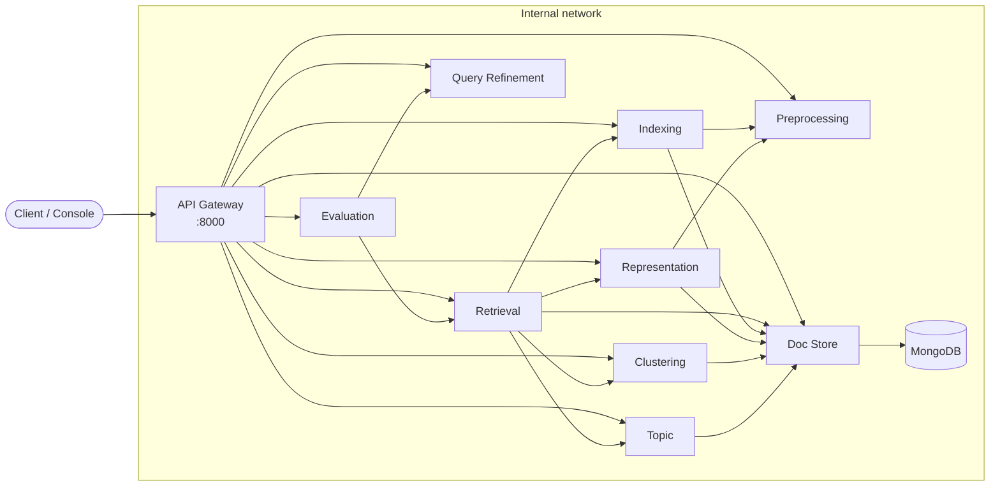

# Hybrid Search Engine

A microservices-based **information retrieval engine** that combines lexical ranking
(TF-IDF, BM25) with semantic ranking (Word2Vec, BERT). Hybrid search runs in two modes: serial
re-ranking, and parallel retrieval merged by rank fusion. The engine is built with **FastAPI**,
**MongoDB** and **Docker Compose**, and has been tested on corpora of more than 500K documents.


---

## Highlights

- **Five ways to rank.** You can search with TF-IDF (vector space model), Okapi BM25, Word2Vec,
  or BERT. A fifth mode, **Hybrid**, combines several of those models.
- **Two kinds of hybrid search.** In **serial** mode, a fast model fetches a set of candidates
  and a stronger model re-orders them. In **parallel** mode, several models search at the same
  time and their results are merged. Merging uses either **Reciprocal Rank Fusion** or a
  **weighted sum** of normalized scores.
- **BM25 settings per query.** The BM25 parameters `k1` and `b` are applied when the query
  runs, so you can change them for each query without rebuilding the model.
- **Query refinement.** SymSpell corrects spelling mistakes but leaves names, brands and
  acronyms alone. WordNet can add synonyms to a query, and that option is off by default.
- **Smaller search space.** The engine can limit a search to the documents in the clusters
  (LSA + KMeans) or topics (LDA) closest to the query. If that isn't possible, it searches the
  whole corpus instead.
- **Built-in evaluation.** Reports include MAP, nDCG@10, Recall@100 and P@10, computed with
  [ranx](https://github.com/AmenRa/ranx). They show scores per query, and you can compare runs
  with and without each extra feature.
- **No training at query time.** Every model is built ahead of time and loaded at startup.
  Search results show the **original** text of each document, read from MongoDB by its ID.

## Architecture

Each capability runs as its own FastAPI service in its own container. An **API Gateway** is
the only service exposed to the outside. All other services talk to each other over HTTP on
a private Docker network, and no service imports another service's code. The services share
request and response models from the `shared/contracts` package.



### Offline and online paths

| | Offline (runs once per dataset) | Online (runs for every query) |
|---|---|---|
| **Steps** | Download the corpus, then store documents, queries and relevance judgments (qrels) in MongoDB. Build the inverted index, the four representations, and the cluster and topic models. | Optionally refine the query, then preprocess it the same way as the documents. Score it with the prebuilt models, optionally prune and fuse the results, then fetch the top documents from MongoDB by ID. |
| **Output** | Files saved under `data/artifacts/`. A build that already exists is skipped. | A ranked list showing each document's original text. |

### Services

| Service | Responsibility |
|---|---|
| `api-gateway` | The only external entry point. Exposes each service's API under its own path, such as `/retrieval` or `/evaluation`. |
| `preprocessing-service` | Cleans text in the same way for documents and queries: normalization, tokenization, stopword removal, stemming and lemmatization. |
| `indexing-service` | Builds the inverted index (`df`, `tf`, `avgdl`) and runs Boolean AND/OR matching. |
| `representation-service` | Builds and scores the TF-IDF, BM25, Word2Vec and BERT models. |
| `retrieval-service` | Runs single-model, hybrid (serial or parallel) and Boolean searches, plus cluster and topic pruning. |
| `query-refinement-service` | Corrects spelling, adds synonyms and suggests corrected queries. |
| `evaluation-service` | Runs evaluations and stores their reports: MAP, nDCG, Recall and P@k, per query, with before/after comparison. |
| `doc-store-service` | Owns the MongoDB collections of documents, queries and qrels, all read by ID. |
| `clustering-service` | Groups documents with TF-IDF, LSA and KMeans, and reports a silhouette score and a 2-D projection. |
| `topic-service` | Builds an LDA topic model and works out which topics a query belongs to. |
| `dashboard-service` | A web console for building models, searching, viewing charts and comparing evaluations. |

Each service follows the same Clean Architecture layout. `domain/` holds the logic and doesn't
depend on the web framework, `adapters/` holds the HTTP clients and artifact storage, and
`api/` holds the FastAPI routes.

## Datasets

The engine works with any dataset from [ir-datasets](https://ir-datasets.com) that includes
test queries and qrels. To switch datasets, change one value in `.env`:

```env
DATASETS=beir/quora/test,wikir/en1k/test
```

| ir-datasets ID | Documents | Content |
|---|---|---|
| `beir/quora/test` | ~523K | Short questions from Quora |
| `wikir/en1k/test` | ~370K | Wikipedia articles |

## Tech stack

**Python 3.11** · FastAPI · Pydantic · httpx · scikit-learn · NumPy / SciPy · gensim ·
sentence-transformers (`all-MiniLM-L6-v2`) · SymSpell · NLTK / WordNet · ranx · ir-datasets ·
MongoDB 7 · Docker Compose

## Getting started

**You need:** Docker Desktop with Compose v2.

```bash
git clone https://github.com/aymansalkhatib/hybrid-search-engine.git
cd hybrid-search-engine
cp .env.example .env
docker compose up --build
```

Once the containers are running, these addresses are available:

| URL | What |
|---|---|
| <http://localhost:8090> | The console, where you can build models, search and run evaluations |
| <http://localhost:8000/docs> | The API Gateway's interactive OpenAPI docs |
| <http://localhost:8081> | mongo-express, a MongoDB browser for local development |

### Typical workflow

You can do all of these steps from the console or through the API. Build steps run as
background jobs, and you can check a job's progress with `GET /jobs/{service}/{job_id}`.

```bash
API=http://localhost:8000
DS='"dataset": "beir/quora/test"'

# 1. Download the corpus and store it in MongoDB
curl -X POST $API/datasets/download -H 'Content-Type: application/json' -d "{$DS}"
curl -X POST $API/datasets/ingest   -H 'Content-Type: application/json' -d "{$DS}"

# 2. Build the inverted index and the models you need
curl -X POST $API/datasets/index        -H 'Content-Type: application/json' -d "{$DS}"
curl -X POST $API/representation/build  -H 'Content-Type: application/json' -d "{$DS, \"model\": \"bm25\"}"
curl -X POST $API/representation/build  -H 'Content-Type: application/json' -d "{$DS, \"model\": \"bert\"}"

# 3. Search: parallel hybrid of BM25 and BERT, merged with Reciprocal Rank Fusion
curl -X POST $API/retrieval/search -H 'Content-Type: application/json' -d "{
  $DS,
  \"query\": \"how can I learn machine learning?\",
  \"model\": \"hybrid\",
  \"top_k\": 10,
  \"hybrid\": {\"mode\": \"parallel\", \"components\": [\"bm25\", \"bert\"], \"fusion\": \"rrf\"}
}"
```

### Running one service

Each service runs on its own:

```bash
docker compose up preprocessing-service
```

## Project structure

```
.
├── services/                 # one folder per service, each with its own Dockerfile
│   ├── api-gateway/
│   ├── preprocessing-service/
│   ├── indexing-service/
│   ├── representation-service/
│   ├── retrieval-service/
│   ├── query-refinement-service/
│   ├── evaluation-service/
│   ├── doc-store-service/
│   ├── clustering-service/
│   ├── topic-service/
│   └── dashboard-service/
├── shared/
│   ├── contracts/            # Pydantic request/response models shared by all services
│   └── ir_common/            # config, dataset catalog, background jobs, error format
├── data/                     # datasets, built models, MongoDB files (not committed)
├── docker-compose.yml
└── .env.example
```

## Configuration

All settings live in a single `.env` file. Start from [`.env.example`](.env.example). The
main settings are:

| Variable | Purpose |
|---|---|
| `DATASETS` | The list of dataset IDs, separated by commas. The first one is the main dataset. |
| `EMBEDDING_MODEL` | The sentence-transformers model used for BERT. |
| `MONGO_URL`, `MONGO_DB` | The connection to the document store. |
| `LOG_LEVEL` | How much the services log. |

## Data and persistence

Downloaded datasets, built models and the MongoDB database are all stored in [`data/`](data/),
which is mounted into the containers. They survive restarts and rebuilds, and you can back
them up by copying that one folder. See [`data/README.md`](data/README.md) for the folder
layout and how to back up or reset it.
